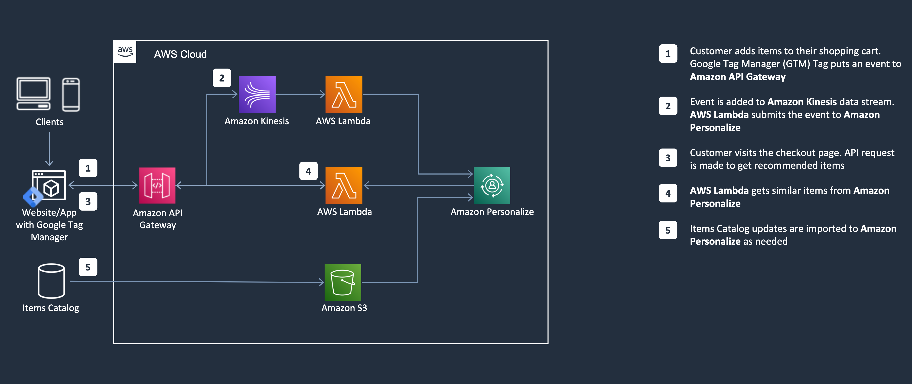
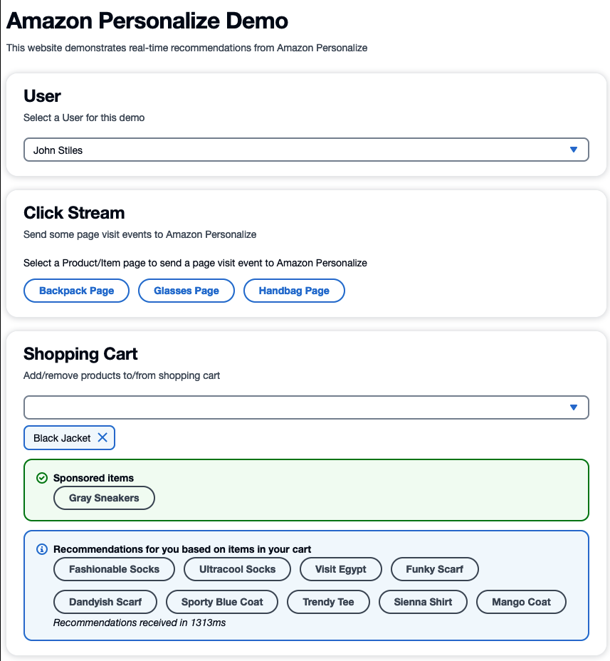

# Online Recommendations using Amazon Personalize
[Amazon Personalize](https://aws.amazon.com/personalize/) allows developers to quickly build and deploy curated recommendations and intelligent user segmentation at scale using machine learning (ML). Because Amazon Personalize can be tailored to your individual needs, you can deliver the right customer experience at the right time and in the right place. 
Enhance customer experiences for online business with personalized recommendations and increase revenue with cross-sell/upsell using Amazon Personalize. This repository contains code developed as part of an AWS Prototyping Engagement.

## Architecture



## Screenshot


## Setup

### Clone repository
```
git clone https://github.com/aws-solutions-library-samples/amazon-personalize-online-recommendations-with-google-tag-manager.git
```

### Setup Amazon Personalize
Launch [Personalize Models.ipynb](packages/api/src/notebook/Personalize%20Models.ipynb) into Amazon SageMaker Notebook with `AdministratorAccess` (Note: For production usecase please apply least privilege permissions), and follow the instructions in the notebook to setup the required Amazon Personalize dataset, recommenders, and campaigns in your AWS Account. 

### Deploy the infrastructure
Use this package to deploy the necessary AWS cloud infrastructure for Amazon API Gateway, AWS Lambda functions, and other resources that will serve as the connective tissue between Amazon Personalize and your website. 

See [API README.md](packages/api/README.md) for instructions on how to set it up

## Setup Google Tag Manager
Use this package's instructions and sample code for setting up the Google Tag Manager tags for your website

See [GTM README.md](packages/gtm-tags/README.md)

## Security

See [CONTRIBUTING](CONTRIBUTING.md#security-issue-notifications) for more information.

## License

This library is licensed under the MIT-0 License. See the LICENSE file.